# Smart House Inventory

## Portfolio Project 3: Python Essentials

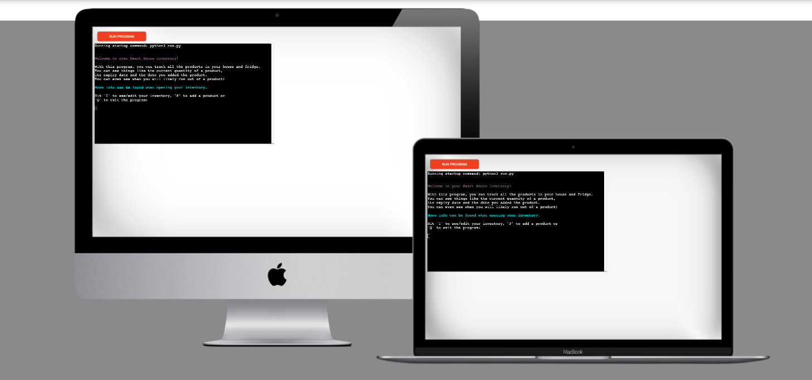

This project is built as part of the Code Institute Full Stack Software Development course. For this course, Dirk Ornee had to built a third Portfolio Project. Inspired by the expired products in his fridge and the occasional lack of toilet paper in his bathroom, he decided to build a Smart House Inventory solution, that will keep track of all the products in his house. The project had to built as a terminal app and is a single user application.

## Live Site

[Smart House Inventory](https://smart-house-inventory.herokuapp.com/)

## Github Repository

[PortfolioProjectThree](https://github.com/DOdrums/PortfolioProjectThree)

## Table of Contents

- [Smart House Inventory](#smart-house-inventory)
  - [Portfolio Project 3: Python Essentials](#portfolio-project-3-python-essentials)
  - [Live Site](#live-site)
  - [Github Repository](#github-repository)
  - [Table of Contents](#table-of-contents)
  - [UX](#ux)
    - [Business Goals](#business-goals)
    - [Target Audience](#target-audience)
    - [User Stories](#user-stories)
      - [As the owner](#as-the-owner)
      - [As a new user](#as-a-new-user)
      - [As a returning user](#as-a-returning-user)
    - [Structure of the app](#structure-of-the-app)
    - [Logic](#logic)
    - [Color Scheme](#color-scheme)
    - [Features](#features)
      - [Main page](#main-page)
      - [Explanation](#explanation)
      - [Inventory](#inventory)
      - [Edit](#edit)
      - [Delete](#delete)
      - [Add product](#add-product)
    - [Future Features](#future-features)
      - [Multi-user support](#multi-user-support)
      - [Notifications](#notifications)
      - [Expiry date warning](#expiry-date-warning)
  - [Data Model](#data-model)
  - [Credits](#credits)
    - [Code](#code)
    - [Images](#images)
    - [Technologies used](#technologies-used)
  - [Testing](#testing)
    - [Pep 8 Online](#pep-8-online)
    - [Bugs](#bugs)
      - [Deployment](#deployment)
  - [Acknowledgements](#acknowledgements)

## UX

### Business Goals

The goal of this project is to assist a user in keeping track of their house inventory and getting insights into when they should run out to the store to replenish some of their favorite products. It's built as a single user application, but could be forked and used with personal a Google Sheets account.

### Target Audience

I think a lot of people recognize the feeling of opening their fridge and finding their beautiful salmon or steak has sadly expired. Or perhaps you want to turn on the dishwasher at night and find yourself out of dishwasher tablets. Even worse, you are in the bathroom and have only one sheet of toilet paper left. Awkward and wasteful situations that can easily be prevented! With the smart house inventory you can easily generate an inventory with estimations when to get new products and neatly keep track of their expiry dates. So, this app is for anybody who whishes to keep better track of their house inventory.

### User Stories

#### As the owner

* I want to build a helpful tool so users can better manage the inventory in their house.
* I want the user to waste less food.
* I want the user to not run out of products.
* I want the user to have a clear and well structured visual of their stock.

#### As a new user

* I want to understand the purpose of the app straight away, even if I stumbled upon it randomly.
* I want to intuitively navigate the app and have clear explanations about each section and function.
* I want to manage the stock in my house.
* I want the app to be smart and do things automatically for me.

#### As a returning user

* I want to be able to use the app in a quick way, without having to scroll trough needless explanations and options.
* I want to get an update about my stock each time I open the app.
* I want to get insights from the app about my stock and what I should do.

### Structure of the app

The app is designed to have a good flow, with clear options explained in a short and concise way. Inventory explanations is purposefully put on top, so returning users don't have to scroll through it every time to get to their inventory. The inventory is fully editable and products can be added to both lists easily.

### Logic

A flowchart was created to make the business logic more clear and as a guide while building the project. Notably missing are the delete and edit function in the inventory and the explanation function on the main page, since this flowchart was created at the start of the process and not updated throughout.

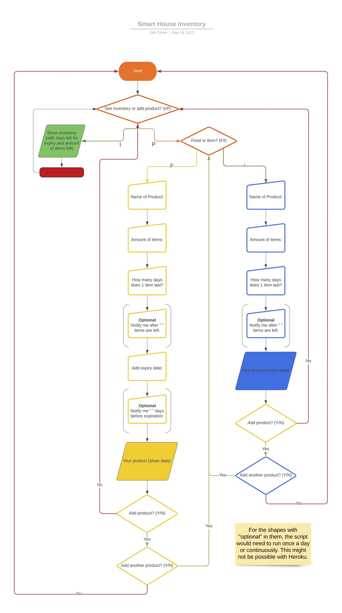

### Color Scheme

Although colors are used on a few lines of text, no real color scheme was used. The text displays either purple, cyan or white.

### Features

The app is divided into two main sections, 'show/edit inventory' and 'add a product'. These two sections together hold all the features of the app. The third option is a explanation page and the last is simply to quit the app.

#### Main page

This page shows a short introduction of the app and gives you the option to either show your inventory, add a product or get an explanation of the full app. New users are encouraged to read the explanation first.

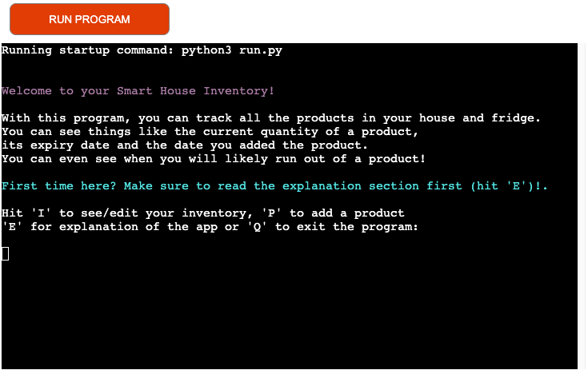

#### Explanation

So, after you first open the app, you will most likely navigate to the explanation page. This is simply a page with an explanation of most of the features in this app. The inventory will show some extra explanation for each individual column.

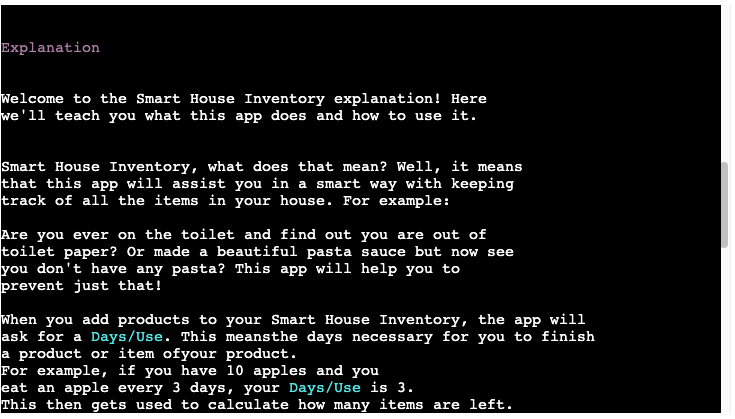

#### Inventory

After reading the explanation, user is encouraged to visit the inventory. Here they can find the products (if any were added already) and read more about each individual column.

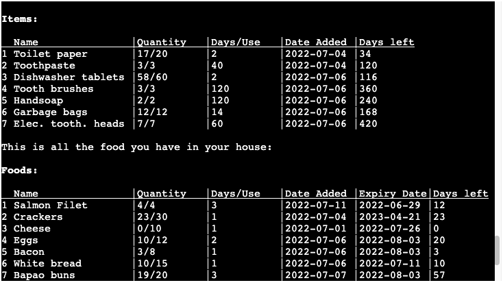

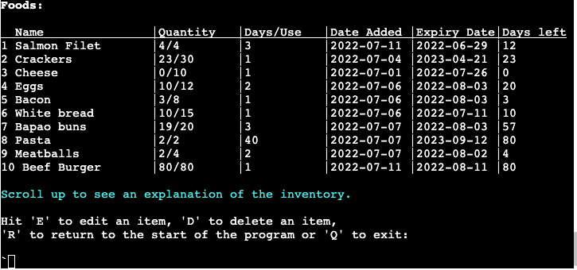

#### Edit

After being presented with the inventory options, if user presses E, they can edit certain fields in the inventory. They will be guided through a series of questions, depending on the option they choose.

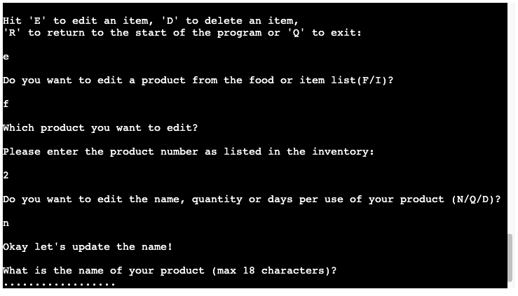

#### Delete

If the user presses D, they can delete one or multiple items of the list.

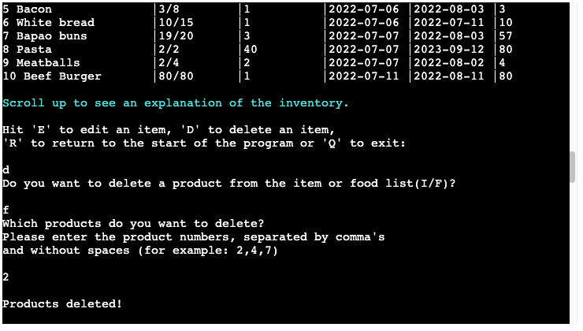

#### Add product

If user pressed R in their inventory, they will return to the home/main page of the app. Here they can hit A to add a product. This will guide them trough a series of questions again, to make sure the user adds the product properly. Each question will also run validations on the users' answers.

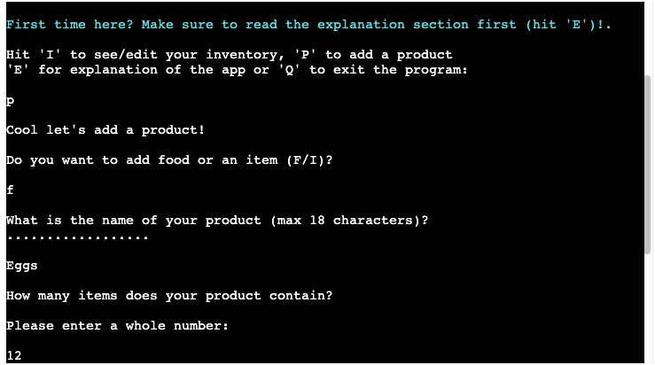

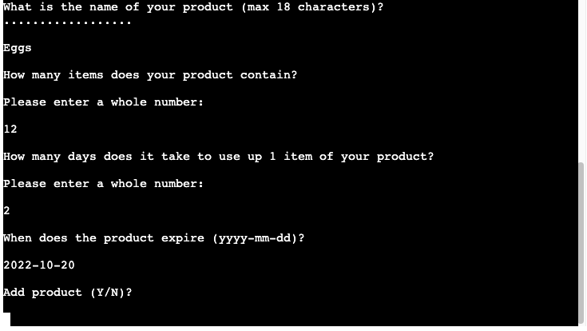

### Future Features

For this app there are two important future features that would greatly increase it's usability.

#### Multi-user support

Include a login page, so users can have their personal google sheet connected without forking the code into their own project. This would probably work better with a general database instead of google sheets though.

#### Notifications

It would be great if a user could enter their email, telephone number or other communication channel, to get notified whenever a product almost runs out. They could also set a daily (or other interval) mail with their inventory.

#### Expiry date warning

Last functionality that could be worthwhile, is to add a feature that notifies the user when the expiry date comes close. This could be either inside the inventory, or via mail/phone etc.

## Data Model

As a data model the app uses a Product class. An instance of this class is created everytime a product is made. It will hold the name, quantity and days per use of the product and generate a date added. The Food class inherits from the Product class and extends it with a expiry date. The Product class also holds the add_product method, which adds the product to the google sheet whenever it's called. The google sheet stores any date. Below are pictures of both sheets that are used for the Food and Item inventory.

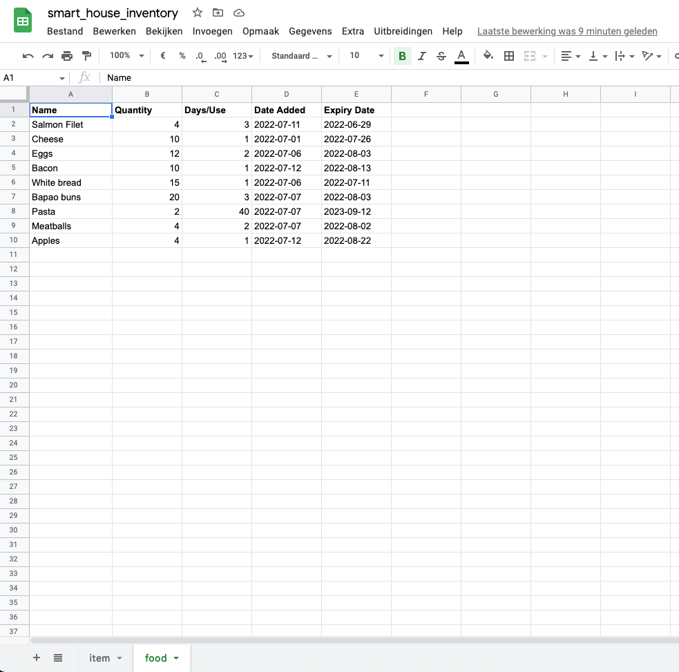

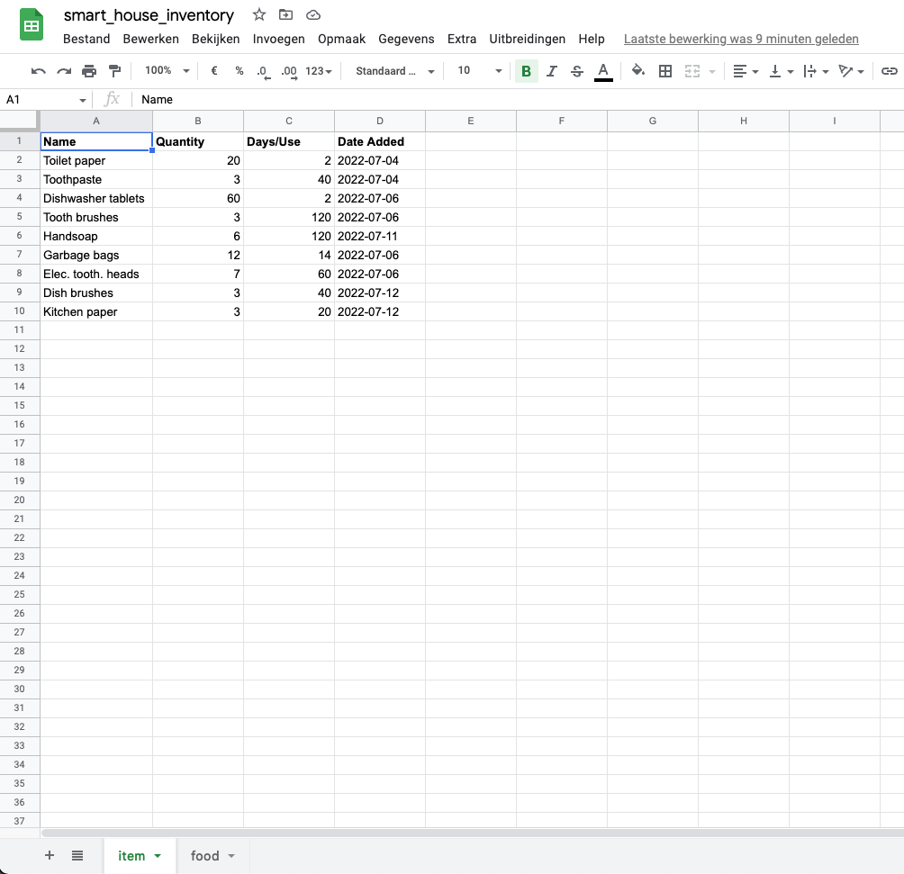


## Credits

### Code

* [Love Sandwiches](https://github.com/DOdrums/walkthrough-love-sandwhiches-python) - a walk through project from Code Institute was
used as general inspiration and for making the Google Sheets API work.
* [Regexland](https://regexland.com/regex-dates/) - to validate the date input with regex
* [datascienceparichay](https://datascienceparichay.com/article/python-check-list-contains-only-numbers/) - to check if a string/list of strings consists of digits
* [finxter](https://blog.finxter.com/how-to-convert-a-string-list-to-an-integer-list-in-python/#:~:text=The%20most%20Pythonic%20way%20to,x%20built%2Din%20function.) - to convert a list of strings to a list of integers
* [stackoverflow(answer from Shubham Naik)](https://stackoverflow.com/a/2803877/16545052) - to convert string date to datetime object
* [youtube](https://www.youtube.com/watch?v=yPQ2Gk33b1U) - to edit/update specific cells in Google Sheet
* [stackoverflow](https://stackoverflow.com/questions/287871/how-do-i-print-colored-text-to-the-terminal) - to style terminal text with colors

### Images

All images used in the readme are screenshots of the project and a multi device mock up generated with [mockup generator](https://techsini.com/multi-mockup/index.php)
The app itself does not contain any images.

### Technologies used

[HTML](https://html.spec.whatwg.org/) - for the structure of the website and mocking of the terminal (written by Code Institute)

[CSS](https://www.w3.org/Style/CSS/Overview.en.html) - to provide styling to the page.

[JavaScript](https://developer.mozilla.org/en-US/docs/Web/JavaScript) - for the structure of the website and mocking of the terminal (written by Code Institute)

[Python](https://www.python.org/) - to write all the logic of the app, using the following libraries:
* Datetime - to generate and manipulate dates easily
* Math library - to round up the quantity when calculating left over quantity.
* Re library - for using Regex to validate user input (would've been very verbose otherwise).
* Gspread and Credentials - for connecting to the google sheet and editing/reading it.

[Gitpod](https://www.gitpod.io/) - used to connect a browser based VScode to github.

[Github](https://github.com/) - used for version control and deployment of the website.

[Heroku](https://dashboard.heroku.com/) - to deploy the app.

[PEP8 Online](http://pep8online.com/) - to validate the Python code.

[Multi Device Website Mockup Generator](https://techsini.com/multi-mockup/index.php) - to create an image of the website shown on different devices.

## Testing

Extensive testing was done to make sure all the features work as expected and all validations fire when needed. 

### Pep 8 Online

The code was run through the Pep 8 online validator to ensure no obvious errors were left in the code. The validator returned three warnings:

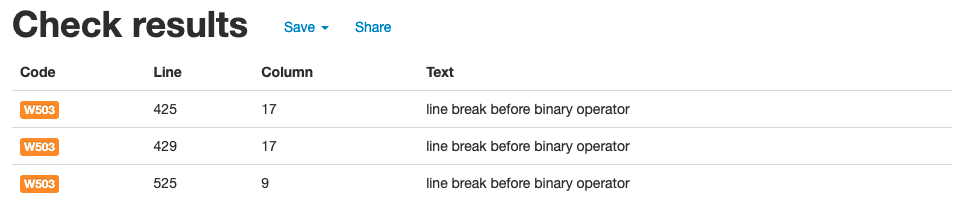

After fixing these warnings, no errors were returned:

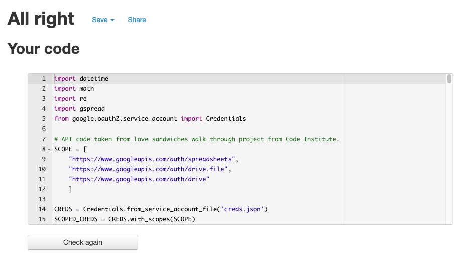

Futhermore, lighthouse was used to check the websites performance and usability. This returned a subpar SEO score:

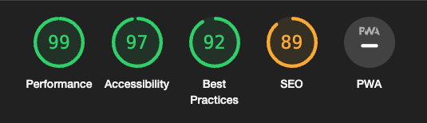

This rating was due to the meta tags missing in the html. After adding these meta tags, the score came back much better:

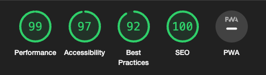

### Bugs

* When creating the ```Food``` subclass, an error ```"too many positional arguments for method call"``` would pop up. This was caused by the ```date_added``` variable being passed as an argument, while in the ```Product``` parent class, this is not passed as an argument. After removing this argument from the ```Food``` init method, the error was resolved and the class worked as expected.
* When using the ```sort()``` method in the ```delete_product()``` function, it kept returning ```None```. The reason for this, is that the ```sort()``` method sorts a list in place, instead of returning a new list. When writing ```list = list.sort()``` the result will be ```None``` because of this.

#### Deployment

To test the app locally, the terminal within VScode was used. To do this simply enter the command ```python run.py``` to start up the app.

When the project was almost finished, it was deployed to Heroku via the following steps:
* Create a new app in Heroku.
* Select "New" and "Create new app".
* Give the new app a name and click "Create new app".
* Click "Settings".
* Navigate to the "Config Vars" section and click "Reveal Config Vars"
* Add KEY: PORT, VALUE: 8000 and CREDS: "contents of creds.json file" to the config vars section.
* In the "Buildpacks" add Python and Nodejs.
* Under "Deployment Method" click on "GitHub" to get access to your repository.
* Enable Automatic Deploys" or "Deploy Branch".

## Acknowledgements

This website was built as part of the Full Stack Software Development course from Code Institute. I would like to thank my mentor Adeye Adegbenga, for his excellent feedback and guidance throughout the development of the project. I would also like to thank friends and family, who all took a look at the finished project to make sure it worked well and if I could improve things.